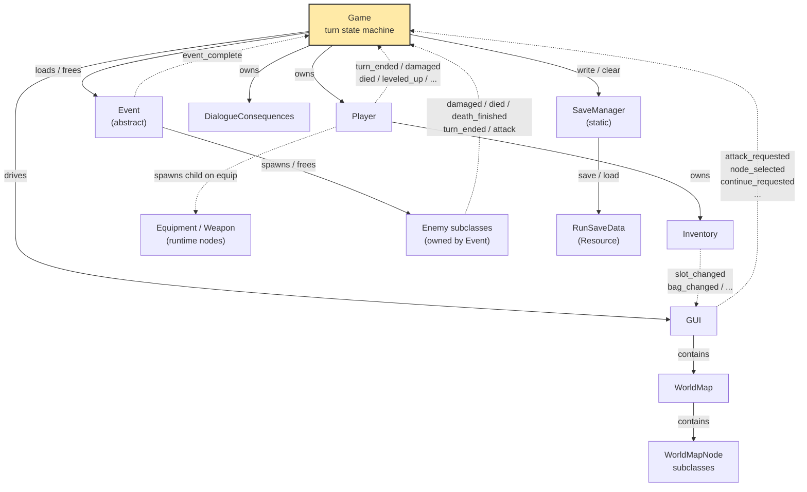
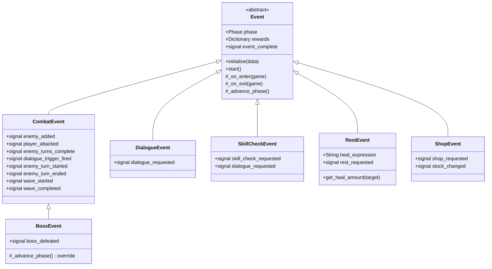
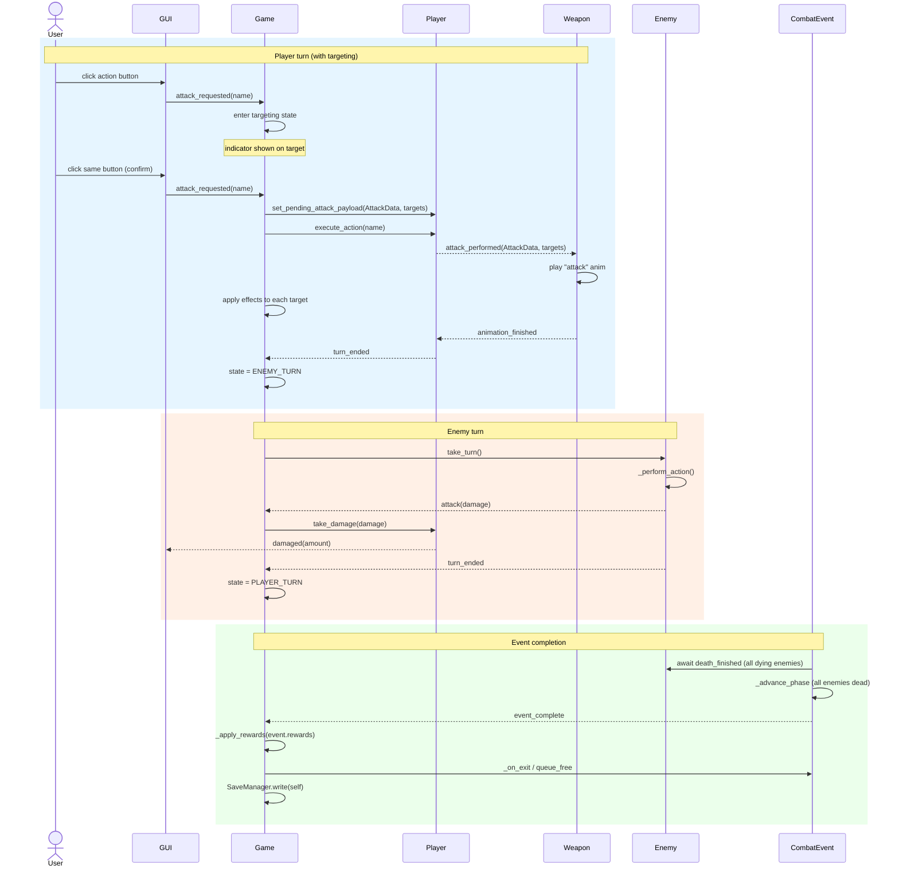
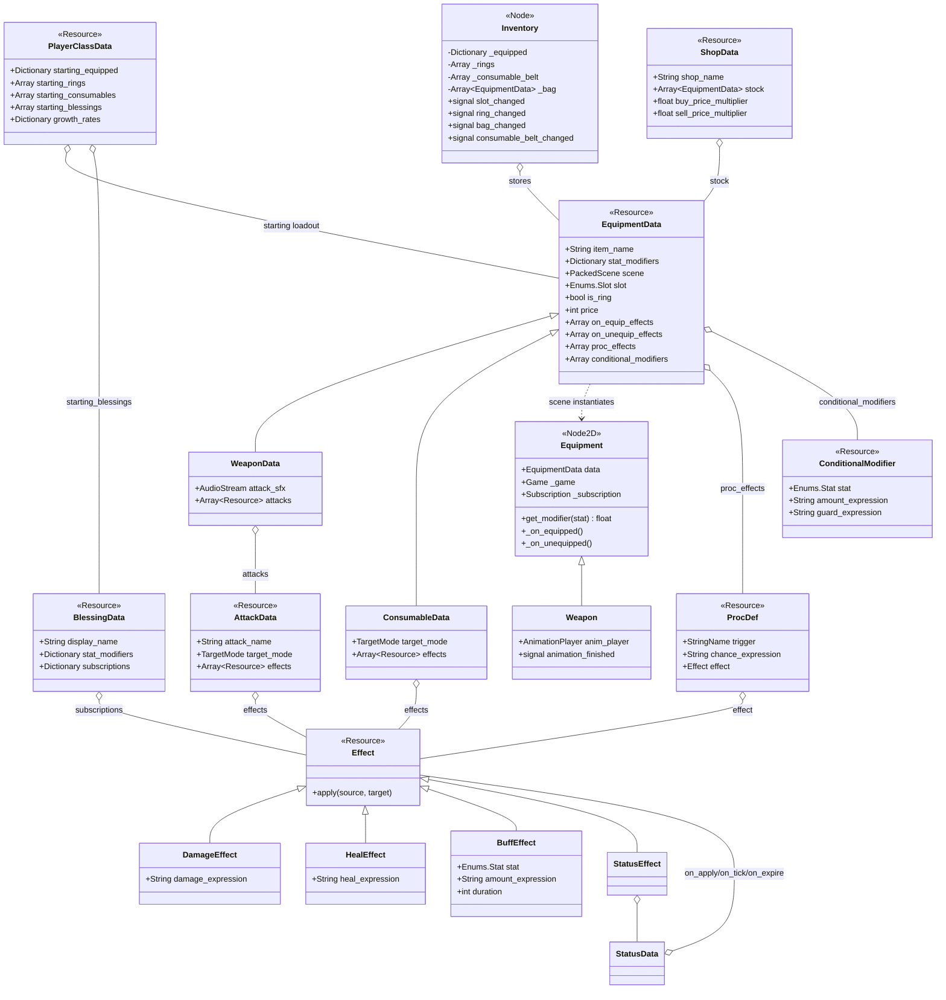
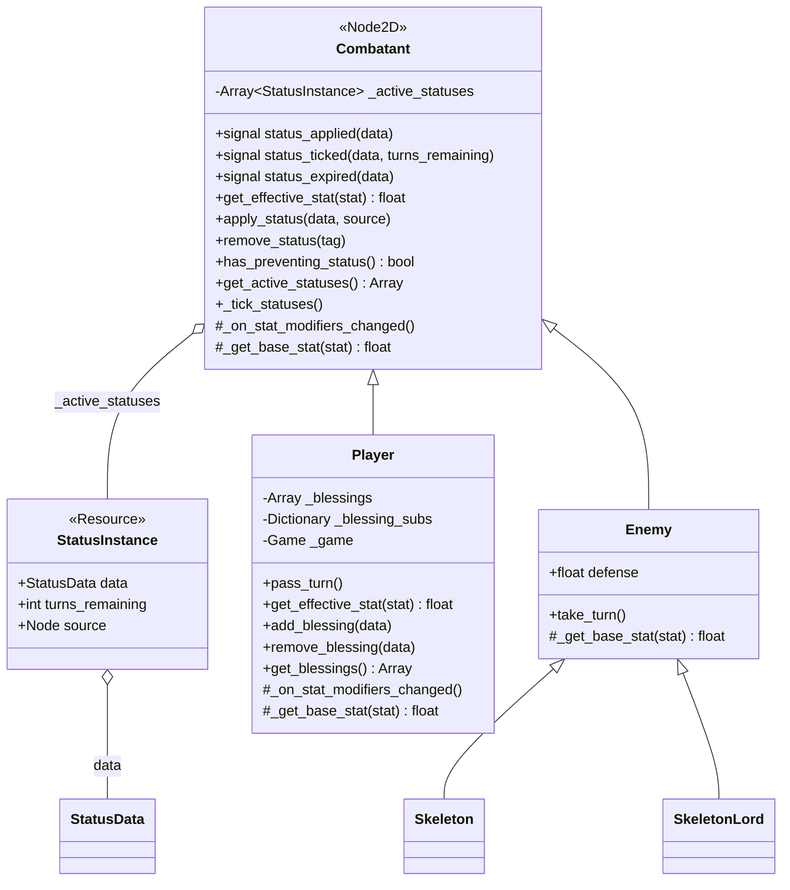

# Architecture Map

A Mermaid-rendered snapshot of how the crawler's code fits together. This file answers **what** is connected to **what** — for the **why** behind each decision, see [[design.md]].

This doc is hand-maintained. When a class is added/renamed, a signal is rewired, or the turn/event flow changes, update the relevant diagram below. Don't regenerate the whole file — scoped edits keep it auditable. See `CLAUDE.md` § Architecture map for the maintenance contract.

Render in any Mermaid-aware viewer: GitHub, VS Code ("Markdown Preview Mermaid Support"), Obsidian.

---

## 1. High-level architecture

`Game` is the hub. It owns the `Player` for the whole run, loads one `Event` at a time, and drives the passive `GUI` via direct method calls. The `GUI` emits intent signals back up; `Game` decides what they mean. Only `game.gd` holds `var player` — events reach the player *through* `Game`, never directly. See [[detailed/game-flow.md]] and [[detailed/gui-design.md]].

---

## 2. Event class hierarchy

All events inherit `Event` and walk the phase enum `SETUP → RUNNING → RESOLUTION → COMPLETE`. See [[detailed/event-system.md]]. Each emits `event_complete` when done and `Game` reads `event.rewards` off the corpse before freeing it. `BossEvent` is the exception — it emits `boss_defeated` on the last wave so `Game` can branch to the VICTORY state instead of the normal post-event flow.

---

## 3. Turn & signal flow

Three flows that cover the combat loop end-to-end. See [[detailed/game-flow.md]] and [[detailed/enemy-system.md]]. The **player turn** is gated by the weapon's attack animation (`turn_ended` doesn't fire until the sprite finishes). The **enemy turn** runs one enemy at a time from a queue `CombatEvent` maintains. **Event completion** is the single exit point — `Game._on_event_complete` applies rewards and frees the event.

`game.gd` also emits a **lifecycle signal bus** at each transition — `player_turn_started/ended`, `enemy_turn_started/ended(enemy)`, `event_started/completed(event)`, `combat_wave_started/completed`, `player_attack_hit`, `enemy_attack_hit`, `player_damaged/healed`, `enemy_damaged/died`, `consumable_used`. These are omitted from the flow below to keep it readable; they fire in parallel with the sequence shown. Statuses, blessings, and equipment procs will subscribe to them in later phases.

---

## 4. Equipment / inventory data model

Equipment is data-driven. See [[detailed/character.md]]. `EquipmentData` is a `Resource` with a `scene: PackedScene` field; on equip, the `Inventory` hands the data to `Game` which instantiates the scene as a child of the `Player`. The runtime node (`Equipment` or `Weapon`) reads its visuals and audio back off the data. `ConsumableData` shares the `EquipmentData` base for the common fields (name, description, sprite, price) even though consumables aren't worn.

Phase 5 added equipment passives: `on_equip_effects` / `on_unequip_effects` (fired by Player on equip/unequip for any item), `proc_effects` (`Array[ProcDef]`, wired to the game lifecycle bus by the scene-backed Equipment node on equip), and `conditional_modifiers` (`Array[ConditionalModifier]`, evaluated in `Player.get_effective_stat` with a re-entrancy guard). See [[design.md]] — Effect System v2.

Phase 6 added `BlessingData` — run-long permanent boons held on `Player._blessings`. `add_blessing` / `remove_blessing` wire/unwire the blessing's `subscriptions` (signal name → Effect, applied to the player) to the game lifecycle bus via `Subscription`. Stat modifiers are summed into `get_effective_stat`. Blessings are granted via `event.rewards["blessings"]` or `PlayerClassData.starting_blessings`.

---

## 5. Combatant class hierarchy

`Combatant` is a `Node2D`-extending base class shared by `Player` and `Enemy`. It owns the status system (`_active_statuses`, `apply_status`, `remove_status`, `_tick_statuses`) and a virtual `_get_base_stat`. `get_effective_stat` on `Combatant` computes base + active-status stat_modifiers; `Player` overrides to also sum equipment modifiers. `BuffEffect` and `StatusEffect` both call `target.apply_status()` — valid for both combatants. `Player._on_stat_modifiers_changed()` calls `_recalculate_max_health()` so CON statuses update max HP immediately. See [[design.md]] — Effect System v2 (2026-05-02).

