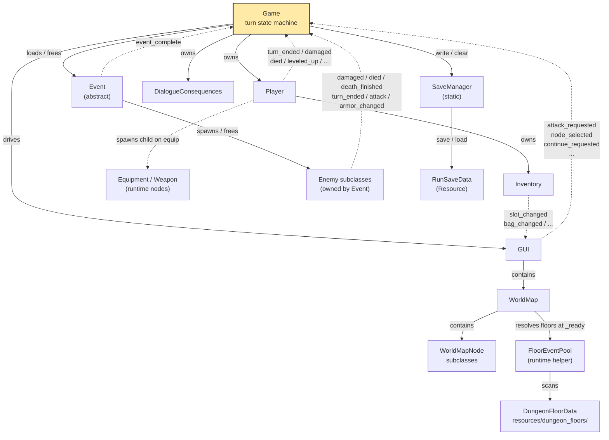
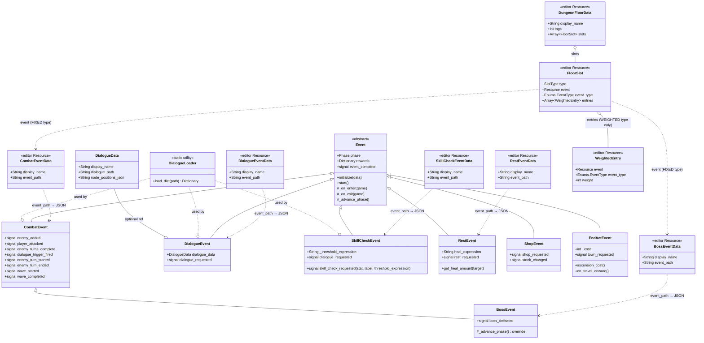
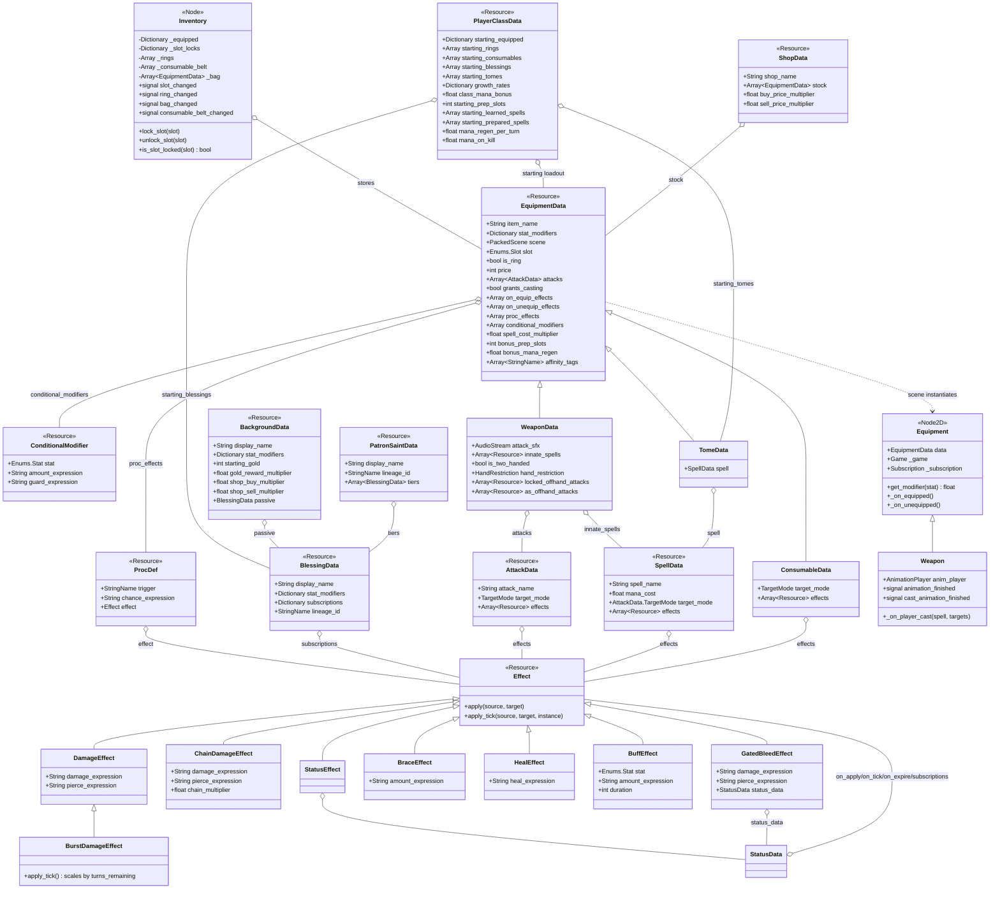
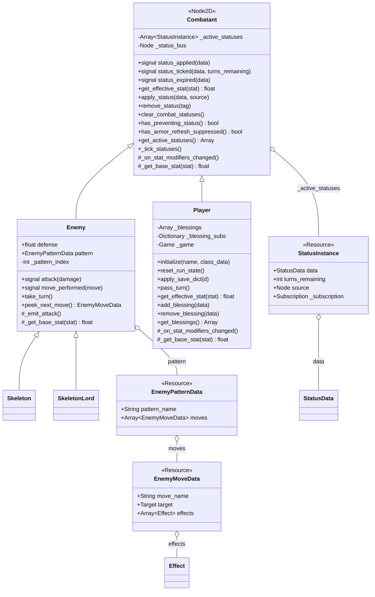

# Architecture Map

A Mermaid-rendered snapshot of how the crawler's code fits together. This file answers **what** is connected to **what** — for the **why** behind each decision, see [[design.md]].

This doc is hand-maintained. When a class is added/renamed, a signal is rewired, or the turn/event flow changes, update the relevant diagram below. Don't regenerate the whole file — scoped edits keep it auditable. See `CLAUDE.md` § Architecture map for the maintenance contract.

Render in any Mermaid-aware viewer: GitHub, VS Code ("Markdown Preview Mermaid Support"), Obsidian.

---

## 1. High-level architecture

`Game` is the hub. It owns the `Player` for the whole run, loads one `Event` at a time, and drives the passive `GUI` via direct method calls. The `GUI` emits intent signals back up; `Game` decides what they mean. Only `game.gd` holds `var player` — events reach the player *through* `Game`, never directly. See [[detailed/game-flow.md]] and [[detailed/gui-design.md]].



---

## 2. Event class hierarchy

All events inherit `Event` and walk the phase enum `SETUP → RUNNING → RESOLUTION → COMPLETE`. See [[detailed/event-system.md]]. Each emits `event_complete` when done and `Game` reads `event.rewards` off the corpse before freeing it. `BossEvent` emits `boss_defeated` on the last wave, but as of the end-of-act work this is just an act climax — the boss completes through the normal post-event flow and returns to the map. Run-ending **VICTORY** now belongs to the end-of-act node (an `EndActMapNode` whose `next_act_scene` is empty), not the boss.



---

## 3. Turn & signal flow

Three flows that cover the combat loop end-to-end. See [[detailed/game-flow.md]] and [[detailed/enemy-system.md]]. The **player turn** is **dual-action**: two independently-gated hands (mainhand = WEAPON slot, offhand = OFFHAND slot). Each action marks its hand used and emits `action_resolved(hand)` — it does **not** end the turn. The mainhand action is still gated by the weapon's animation (its `attack_hit`/`cast_hit` waits for the sprite); offhand actions resolve immediately (v1, non-animating). The turn ends only when the player presses **End Turn** (`end_turn_requested` → `Player.end_turn()` → `turn_ended`), which is also where statuses tick. The **enemy turn** runs one enemy at a time from a queue `CombatEvent` maintains. **Event completion** is the single exit point — `Game._on_event_complete` applies rewards and frees the event.

`game.gd` also emits a **lifecycle signal bus** at each transition — `player_turn_started/ended`, `enemy_turn_started/ended(enemy)`, `event_started/completed(event)`, `combat_wave_started/completed`, `player_attack_hit`, `enemy_attack_hit`, `player_damaged/healed`, `enemy_damaged/died`, `consumable_used`. These are omitted from the flow below to keep it readable; they fire in parallel with the sequence shown. Statuses, blessings, and equipment procs will subscribe to them in later phases.

```mermaid
sequenceDiagram
    actor User
    participant GUI
    participant Game
    participant Player
    participant Weapon
    participant Enemy
    participant Event as CombatEvent

    rect rgb(230, 245, 255)
    note over User,Weapon: Player turn — mainhand attack (dual-action)
    Game->>Player: begin_turn()  (reset _mainhand_used/_offhand_used)
    User->>GUI: click action button (hand)
    GUI->>Game: attack_requested(hand, name)
    Game->>Game: enter targeting state (remember hand)
    User->>GUI: click same button (confirm)
    GUI->>Game: attack_requested(hand, name)
    Game->>Player: set_pending_attack_payload(AttackData, targets)
    Game->>Player: execute_action(hand, name)
    Player-->>Weapon: attack_performed / offhand_attack_performed(AttackData, targets)  (per hand)
    Weapon->>Weapon: play "attack" anim  (offhand weapon mirrored via scale.x = -1)
    Game->>Game: apply effects to each target
    Weapon-->>Player: animation_finished
    Player-->>Game: action_resolved(hand)  (hand marked used; turn NOT ended)
    Game->>GUI: refresh bar — used hand disabled, other hand live
    end

    rect rgb(220, 235, 255)
    note over User,Player: Player turn — end turn (explicit)
    User->>GUI: click End Turn
    GUI->>Game: end_turn_requested
    Game->>Player: end_turn()  (offhand may be unused)
    Player->>Player: _tick_statuses()
    Player-->>Game: turn_ended
    Game->>Game: state = ENEMY_TURN
    end

    rect rgb(255, 240, 230)
    note over Game,Enemy: Enemy turn
    Game->>Enemy: take_turn()
    Enemy->>Enemy: _perform_action() → _emit_attack()
    alt has EnemyPatternData
        Enemy-->>Game: move_performed(move)  (via CombatEvent)
        Game->>Player: effect.apply(enemy, player)  (SELF → enemy)
        Player-->>GUI: damaged(amount)
    else no pattern (legacy)
        Enemy-->>Game: attack(damage)
        Game->>Player: take_damage(damage)
        Player-->>GUI: damaged(amount)
    end
    Enemy-->>Game: turn_ended
    Game->>Game: state = PLAYER_TURN
    end

    rect rgb(235, 255, 235)
    note over Event,Game: Event completion
    Event->>Enemy: await death_finished (all dying enemies)
    Event->>Event: _advance_phase (all enemies dead)
    Event-->>Game: event_complete
    Game->>Game: _apply_rewards(event.rewards)
    Game->>Event: _on_exit / queue_free
    Game->>Game: SaveManager.write(self)
    end
```

---

## 4. Equipment / inventory data model

Equipment is data-driven. See [[detailed/character.md]]. `EquipmentData` is a `Resource` with a `scene: PackedScene` field; on equip, the `Inventory` hands the data to `Game` which instantiates the scene as a child of the `Player`. The runtime node (`Equipment` or `Weapon`) reads its visuals and audio back off the data. `ConsumableData` shares the `EquipmentData` base for the common fields (name, description, sprite, price) even though consumables aren't worn.

Phase 5 added equipment passives: `on_equip_effects` / `on_unequip_effects` (fired by Player on equip/unequip for any item), `proc_effects` (`Array[ProcDef]`, wired to the game lifecycle bus by the scene-backed Equipment node on equip), and `conditional_modifiers` (`Array[ConditionalModifier]`, evaluated in `Player.get_effective_stat` with a re-entrancy guard). See [[design.md]] — Effect System v2.

Phase 6 added `BlessingData` — run-long permanent boons held on `Player._blessings`. `add_blessing` / `remove_blessing` wire/unwire the blessing's `subscriptions` (signal name → Effect, applied to the player) to the game lifecycle bus via `Subscription`. Stat modifiers are summed into `get_effective_stat`. Blessings are granted via `event.rewards["blessings"]` or `PlayerClassData.starting_blessings`.

Phase 7 added the spell system. `SpellData` (resource, mirrors `AttackData`) carries `spell_name`, `mana_cost`, `target_mode`, and `effects: Array[Resource]`. `EquipmentData` gains `spell_cost_multiplier: float = 1.0` and `bonus_prep_slots: int = 0`. `WeaponData` gains `innate_spells: Array[Resource]` — registered as player actions on equip alongside `attacks`, bypassing prep slots. `Enums.Slot` gains `OFFHAND` (value 6). `Player` gains mana (`max_mana`, `mana` derived from SPI like health from CON), a learned-spell roster, a prep-slot-indexed prepared list, and the `_do_cast` action callable. `PlayerClassData` gains `class_mana_bonus`, `starting_prep_slots`, `starting_learned_spells`, `starting_prepared_spells`. Mana restores fully at world-node entry in `_on_world_node_selected`.

Phase 8 extended the spell system with five additions. **Two-handed lock**: `WeaponData.is_two_handed` causes `Player._setup_equipment` to call `Inventory.lock_slot(OFFHAND)` on equip and `unlock_slot` on teardown; `Inventory._slot_locks: Dictionary` enforces this in `equip()`. **Spell animations**: `Weapon` gains `cast_animation_finished` signal and `_on_player_cast()` handler (falls back to "attack" anim if no "cast" anim exists); `_do_cast` in `Player` now gates `cast_hit` behind animation like `_do_attack` does for `attack_hit`. **Mana regen**: `EquipmentData.bonus_mana_regen`, `PlayerClassData.mana_regen_per_turn / mana_on_kill` feed into `Player.mana_regen / mana_on_kill` (computed in `_recalculate_mana_regen`, called from `_recalculate_max_mana`); `game.gd` restores mana at the start of each player turn and on each enemy kill. **Tomes**: `TomeData extends EquipmentData` (adds `spell`) so tomes are ordinary bag items in `Inventory._bag` (no separate list). `InventoryPanel._on_bag_button_pressed` branches on `TomeData` — instead of equipping, it removes the tome from the bag and calls `player.learn_spell` (blocked by the dungeon lock, since removal is); the detail panel shows "Teaches: <spell>". Delivered via `PlayerClassData.starting_tomes` and `event.rewards["tomes"]`, both routed to `add_to_bag`. **Affinity tags**: `EquipmentData.affinity_tags: Array[StringName]` — data field only; loot pool logic deferred until procedural generation is built.

Phase 9 added the **three-layer character identity**: alongside `PlayerClassData`, creation now picks a `BackgroundData` (*who you were*) and a `PatronSaintData` (*what watches over you*). `BackgroundData` carries a signed `stat_modifiers` shift, `starting_gold`, economy floats (`gold_reward_multiplier` read in `game.gd._apply_rewards`; `shop_buy_multiplier`/`shop_sell_multiplier` injected into the shop event's `data` dict and stacked onto `ShopData`'s own multipliers in `ShopEvent.initialize`), and an optional `passive: BlessingData`. `PatronSaintData` wraps three `BlessingData` `tiers` (one per act) sharing a `lineage_id` (new field on `BlessingData`). `Player` gained `gold_reward_multiplier`/`shop_buy_multiplier`/`shop_sell_multiplier` fields, `_background`/`_patron`/`_patron_tier_index` state, `_setup_background`/`_setup_patron` (mirroring `_setup_starting_blessings`), an `ascend_patron()` tier-swap (Phase 2 shrine hook), a `_background.stat_modifiers` term in `get_effective_stat`, and save/load fields. `Player.initialize()` / `GUI.character_created` / `CharacterCreationPanel.character_confirmed` all gained optional `background`/`patron` params (default `null`, back-compatible). The creation UI (`character_creation_panel.gd` + the `CharacterCreationPanel` subtree in `game.tscn`) is a hand-built 4-step wizard (Class → Background → Patron Saint → Confirm) anchored full-rect so it resizes with the viewport. Both resources are pure schema-driven in the content editor. Saint flow: `CharacterCreationPanel.character_confirmed → GUI.character_created → game._on_character_created → player.initialize(name, class, background, patron)`.

**Phase 2 — shrine ascension (2026-06-21).** A hand-placed `ShrineMapNode` (mirrors `ShopMapNode`; carries `shrine_scene` + `ascension_cost`, bypasses the floor pool) is placed as a between-acts checkpoint that funnels the act-1 end nodes into the boss. Selecting it loads `ShrineEvent`, which reads the player's active saint at runtime via new public `Player` accessors (`get_patron`, `can_ascend_patron`, `get_active_tier`, `get_next_tier`) and emits `shrine_requested(saint_name, has_next, next_tier_name, next_tier_desc, next_stat_mods, cost)`. `game._on_shrine_requested` shows `ShrinePanel` (Ascend / Leave). On Ascend, `GUI.shrine_ascend_requested → game._on_gui_shrine_ascend_requested → ShrineEvent.on_shrine_choice(true)`; in `_on_resolution` the event charges the gold tithe (`player.spend_gold`) and calls `player.ascend_patron()`, which **replaces** the current tier blessing with the next (never stacks). Leave keeps gold and tier. If there is no patron or it is already at the final tier the shrine is "silent" (Leave only). Tier ascension persists via the existing `_patron_tier_index` save field.

**Phase 3 — end-of-act town + act transition (2026-06-27).** `ShrineMapNode`/`ShrineEvent` were renamed `EndActMapNode`/`EndActEvent` and reframed as an end-of-act **town hub**. `EndActMapNode` adds `next_act_scene: PackedScene` (empty = final act). Selecting it loads `EndActEvent`, which emits `town_requested` and stays in `RUNNING` while `game._on_town_requested` shows `TownPanel` (services: **Temple**, **Travel Onward**). **Temple** (`GUI.town_temple_requested → game._on_gui_town_temple_requested`) reuses the unchanged `ShrinePanel`; ascension is now applied **live** in `game._on_gui_shrine_ascend_requested` (charge tithe + `ascend_patron`) and returns to the town, rather than at event resolution. **Travel Onward** (`GUI.town_travel_requested → game._on_gui_town_travel_requested → EndActEvent.on_travel_onward()`) completes the event. The single return point `game._on_dungeon_complete` branches on `EndActMapNode` to `_advance_to_next_act`, which either `GUI.swap_world_map(next_act_scene)` (frees the old map, re-instantiates named `WorldMap` so saved node paths stay valid, then `_enter_world_map`) and bumps `current_act`, or `_enter_victory()` when there is no next act. `RunSaveData` (now `VERSION = 2`) gained `current_act` + `active_act_scene_path`, and `_on_continue_requested` swaps to the saved act map before `apply_state_dict`. Placeholder act 2 is `world_map_act2.tscn` (standalone copy; a scene can't reference itself).

**Phase 9 — dual-action combat (2026-07-02).** The player turn splits into two per-hand action slots. `Player` swaps its single `_actions` registry for per-hand registries (`_hand_actions[Hand]`, with `_hand_attacks`/`_hand_spells` source lists) gated by `_mainhand_used`/`_offhand_used`; `begin_turn()` resets them, `execute_action(hand, name)` marks a hand and emits `action_resolved(hand)` (via a new `_action_resolving` flag in `_process`), and `end_turn()` is the sole emitter of `turn_ended` (End Turn button `GUI.end_turn_requested`, or stun). `_rebuild_hand_actions()` derives each hand's actions from its equipped item — `attacks`, plus the prepared repertoire iff `grants_casting` (a **focus**), else a weapon's `innate_spells`; an empty hand gets the shared `unarmed_strike.tres` punch; a two-hander's locked offhand draws from `locked_offhand_attacks`. `attacks` + `grants_casting` are promoted to `EquipmentData`; `WeaponData` adds `locked_offhand_attacks`. `game.gd` resolves/targets per hand and rebuilds a two-group bar on `Player.hand_actions_changed` / `action_resolved`; `GUI.rebuild_action_buttons` builds `MainhandActions`/`OffhandActions` groups + `EndTurnButton` under `ActionMenu` (fallback nodes auto-created if the scene omits them). See [[design.md]] — Dual-action combat.

**Phase 10 — per-hand weapon restriction + animated offhand weapons (2026-07-03).** `WeaponData` gains `hand_restriction` (`Enums.HandRestriction` — `MAINHAND_ONLY`/`OFFHAND_ONLY`/`EITHER`, default `MAINHAND_ONLY`) and `as_offhand_attacks`; the old `offhand_attacks` is renamed `locked_offhand_attacks`. `InventoryPanel._on_bag_button_pressed` routes a weapon to a slot via `_target_slot_for` (by `hand_restriction`), and an `EITHER` weapon enters a self-contained **hand-selection** mode — candidate slot buttons (`WEAPON`/`OFFHAND`) highlight, `_unhandled_input` cycles with `←/→` and confirms with `Space`/`Enter`/`ui_accept` or a slot click, `Esc` cancels; bag removal is deferred to confirm and a `visibility_changed` guard cancels a dangling choice. `Player._build_hand_actions` uses a weapon's `as_offhand_attacks` when it sits in the offhand (falling back to `attacks`). Animated offhand weapons: `_setup_equipment`/`_teardown_equipment` wire an OFFHAND `Weapon` node flipped `scale.x = -1`, driven by new `offhand_attack_performed`/`offhand_cast_performed` signals; `_do_attack`/`_do_cast` defer the offhand hit via parallel `_offhand_*` in-flight state, and `_is_turn_complete()`/`set_weapon_visible` account for it. Cosmetic mirrored `OffhandLayer` added to the paper doll. See [[design.md]] — Per-hand weapon restriction.

**Phase 11 — defense armor buffer + dodge decay (2026-07-07).** `DEF` becomes a per-round **armor buffer** (not percentage) on both `Player` and `Enemy`: `armor`/`max_armor` fields, `refresh_armor()` refilling to effective DEF, and an `_apply_defense()` rewritten to absorb damage from the buffer (overflow bleeds to HP, no 1-damage floor). Refresh happens at **round start** — `player.begin_turn()` for the player; `CombatEvent._on_round_started()` (newly subscribed to the `game.player_turn_started` bus signal in `_on_enter`/`_on_exit`) for every living enemy. `AGI` dodge (`Player._roll_dodge()`) halves per successful dodge that round via `_dodge_streak` (reset in `begin_turn()`). New signals `Player.armor_changed`/`armor_absorbed` and `Enemy.armor_changed` drive the armor HUD: `GUI.update_player_armor` (a `PlayerArmorBar`/`PlayerArmorLabel` in `PlayerHUD`) and `GUI.update_enemy_armor` (an `Armor` overlay `Sprite2D` on `HealthBar`, `set_armor`); `game._on_player_armor_absorbed` logs a combat line. `armor`/`max_armor`/`_dodge_streak` are transient (not saved). See [[design.md]] — DEF is a refreshing per-round armor buffer.



---

## 5. Combatant class hierarchy

`Combatant` is a `Node2D`-extending base class shared by `Player` and `Enemy`. It owns the status system (`_active_statuses`, `apply_status`, `remove_status`, `_tick_statuses`) and a virtual `_get_base_stat`. `get_effective_stat` on `Combatant` computes base + active-status stat_modifiers; `Player` overrides to also sum equipment modifiers. `BuffEffect` and `StatusEffect` both call `target.apply_status()` — valid for both combatants. `Player._on_stat_modifiers_changed()` calls `_recalculate_max_health()` so CON statuses update max HP immediately. See [[design.md]] — Effect System v2 (2026-05-02).

Status statuses can also carry `subscriptions` (signal name → Effect): `apply_status` wires them to the `game.gd` lifecycle bus via `Subscription` (bus injected into `_status_bus` — Player at `set_player`, Enemy at `_on_combat_enemy_added`) and `remove_status`/`clear_combat_statuses`/expiry unwire them, mirroring blessings. `_tick_statuses` invokes `on_tick` via `Effect.apply_tick(source, target, instance)` (defaults to `apply`) so a tick effect can read `instance.turns_remaining` — used by `BurstDamageEffect` (Fire). `has_armor_refresh_suppressed()` gates `refresh_armor()` for Shatter. `take_damage`/`_apply_defense` on both subclasses take an optional `pierce` that reduces this hit's armor absorption (Frost). See [[design.md]] — Elemental & martial status-verb systems (2026-07-09).

`Player.reset_run_state()` is the single owner of per-run teardown (equipment teardown, blessing/status clear, spell roster clear, inventory dungeon-lock reset). Both `initialize()` and `apply_save_dict()` call it first; both game entry points (`_on_character_created`, `_on_continue_requested`) call `Game._reset_run_state()` before touching the player. See [[design.md]] — Run-state reset pattern (2026-05-08).



`EnemyPatternData` is an ordered, looping list of `EnemyMoveData`; each move carries the same `Effect` subclasses the player uses. `Enemy._emit_attack()` (the single emission seam — animation-gated enemies fire it from an animation method track) emits `move_performed(move)` and advances `_pattern_index` when a pattern is set, else falls back to `attack(attack_damage)`. `game._on_enemy_move_performed()` applies the move's effects (`target = player`, or the enemy for `SELF` moves), mirroring `_on_player_attack_hit`. Patterns are additive to the `_perform_action()` override hook. See [[design.md]] — Enemy action patterns (2026-07-01).
