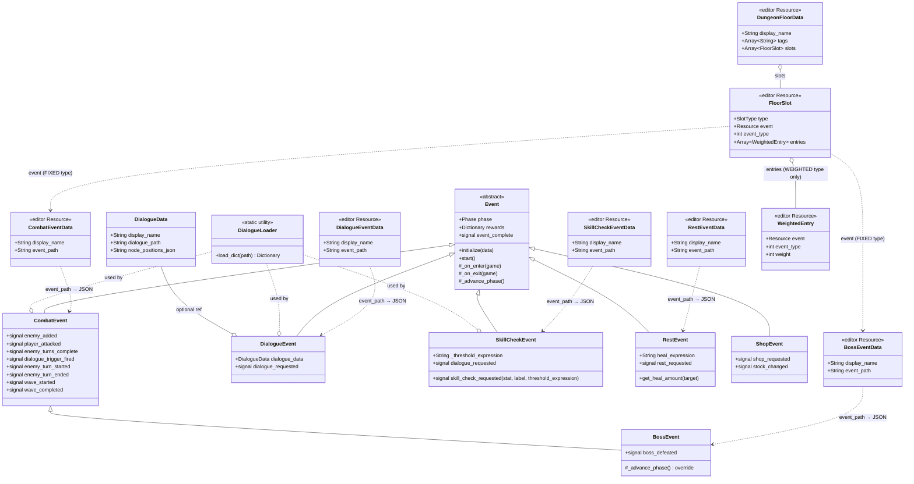
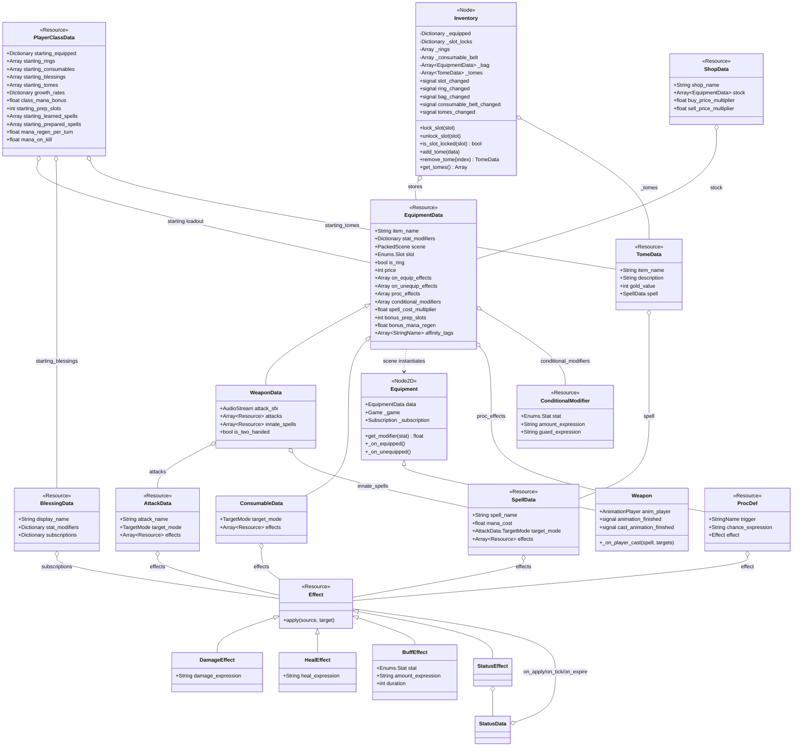
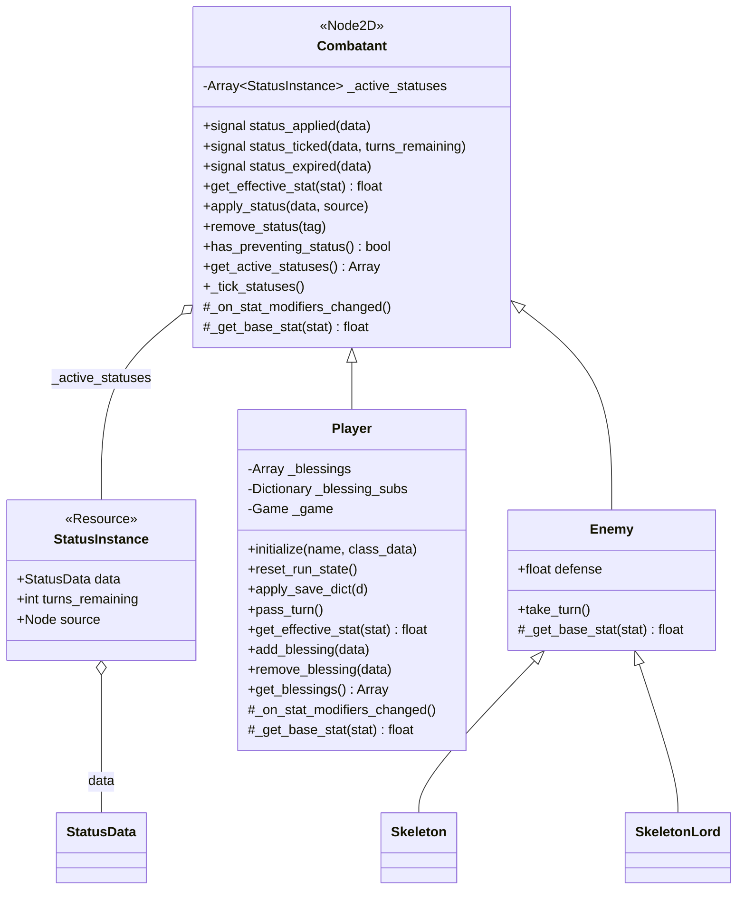

# Architecture Map

A Mermaid-rendered snapshot of how the crawler's code fits together. This file answers **what** is connected to **what** — for the **why** behind each decision, see [[design.md]].

This doc is hand-maintained. When a class is added/renamed, a signal is rewired, or the turn/event flow changes, update the relevant diagram below. Don't regenerate the whole file — scoped edits keep it auditable. See `CLAUDE.md` § Architecture map for the maintenance contract.

Render in any Mermaid-aware viewer: GitHub, VS Code ("Markdown Preview Mermaid Support"), Obsidian.

---

## 1. High-level architecture

`Game` is the hub. It owns the `Player` for the whole run, loads one `Event` at a time, and drives the passive `GUI` via direct method calls. The `GUI` emits intent signals back up; `Game` decides what they mean. Only `game.gd` holds `var player` — events reach the player *through* `Game`, never directly. See [[detailed/game-flow.md]] and [[detailed/gui-design.md]].


---

## 2. Event class hierarchy

All events inherit `Event` and walk the phase enum `SETUP → RUNNING → RESOLUTION → COMPLETE`. See [[detailed/event-system.md]]. Each emits `event_complete` when done and `Game` reads `event.rewards` off the corpse before freeing it. `BossEvent` is the exception — it emits `boss_defeated` on the last wave so `Game` can branch to the VICTORY state instead of the normal post-event flow.



---

## 3. Turn & signal flow

Three flows that cover the combat loop end-to-end. See [[detailed/game-flow.md]] and [[detailed/enemy-system.md]]. The **player turn** is gated by the weapon's attack animation (`turn_ended` doesn't fire until the sprite finishes). The **enemy turn** runs one enemy at a time from a queue `CombatEvent` maintains. **Event completion** is the single exit point — `Game._on_event_complete` applies rewards and frees the event.

`game.gd` also emits a **lifecycle signal bus** at each transition — `player_turn_started/ended`, `enemy_turn_started/ended(enemy)`, `event_started/completed(event)`, `combat_wave_started/completed`, `player_attack_hit`, `enemy_attack_hit`, `player_damaged/healed`, `enemy_damaged/died`, `consumable_used`. These are omitted from the flow below to keep it readable; they fire in parallel with the sequence shown. Statuses, blessings, and equipment procs will subscribe to them in later phases.

```mermaid
sequenceDiagram
    actor User
    participant GUI
    participant Game
    participant Player
    participant Weapon
    participant Enemy
    participant Event as CombatEvent

    rect rgb(230, 245, 255)
    note over User,Weapon: Player turn — attack (with targeting)
    User->>GUI: click action button
    GUI->>Game: attack_requested(name)
    Game->>Game: enter targeting state
    note over Game: indicator shown on target
    User->>GUI: click same button (confirm)
    GUI->>Game: attack_requested(name)
    Game->>Player: set_pending_attack_payload(AttackData, targets)
    Game->>Player: execute_action(name)
    Player-->>Weapon: attack_performed(AttackData, targets)
    Weapon->>Weapon: play "attack" anim
    Game->>Game: apply effects to each target
    Weapon-->>Player: animation_finished
    Player-->>Game: turn_ended
    Game->>Game: state = ENEMY_TURN
    end

    rect rgb(220, 235, 255)
    note over User,Player: Player turn — spell cast
    User->>GUI: click spell button
    GUI->>Game: attack_requested(spell_name)
    Game->>Game: mana check; enter targeting state
    User->>GUI: click same button (confirm)
    GUI->>Game: attack_requested(spell_name)
    Game->>Player: set_pending_spell_payload(SpellData, targets)
    Game->>Player: execute_action(spell_name)
    Player->>Player: spend_mana; emit cast_performed
    Player-->>Game: cast_hit(spell, targets)
    Game->>Game: apply spell effects to each target
    Player-->>Game: turn_ended
    Game->>Game: state = ENEMY_TURN
    end

    rect rgb(255, 240, 230)
    note over Game,Enemy: Enemy turn
    Game->>Enemy: take_turn()
    Enemy->>Enemy: _perform_action()
    Enemy-->>Game: attack(damage)
    Game->>Player: take_damage(damage)
    Player-->>GUI: damaged(amount)
    Enemy-->>Game: turn_ended
    Game->>Game: state = PLAYER_TURN
    end

    rect rgb(235, 255, 235)
    note over Event,Game: Event completion
    Event->>Enemy: await death_finished (all dying enemies)
    Event->>Event: _advance_phase (all enemies dead)
    Event-->>Game: event_complete
    Game->>Game: _apply_rewards(event.rewards)
    Game->>Event: _on_exit / queue_free
    Game->>Game: SaveManager.write(self)
    end
```

---

## 4. Equipment / inventory data model

Equipment is data-driven. See [[detailed/character.md]]. `EquipmentData` is a `Resource` with a `scene: PackedScene` field; on equip, the `Inventory` hands the data to `Game` which instantiates the scene as a child of the `Player`. The runtime node (`Equipment` or `Weapon`) reads its visuals and audio back off the data. `ConsumableData` shares the `EquipmentData` base for the common fields (name, description, sprite, price) even though consumables aren't worn.

Phase 5 added equipment passives: `on_equip_effects` / `on_unequip_effects` (fired by Player on equip/unequip for any item), `proc_effects` (`Array[ProcDef]`, wired to the game lifecycle bus by the scene-backed Equipment node on equip), and `conditional_modifiers` (`Array[ConditionalModifier]`, evaluated in `Player.get_effective_stat` with a re-entrancy guard). See [[design.md]] — Effect System v2.

Phase 6 added `BlessingData` — run-long permanent boons held on `Player._blessings`. `add_blessing` / `remove_blessing` wire/unwire the blessing's `subscriptions` (signal name → Effect, applied to the player) to the game lifecycle bus via `Subscription`. Stat modifiers are summed into `get_effective_stat`. Blessings are granted via `event.rewards["blessings"]` or `PlayerClassData.starting_blessings`.

Phase 7 added the spell system. `SpellData` (resource, mirrors `AttackData`) carries `spell_name`, `mana_cost`, `target_mode`, and `effects: Array[Resource]`. `EquipmentData` gains `spell_cost_multiplier: float = 1.0` and `bonus_prep_slots: int = 0`. `WeaponData` gains `innate_spells: Array[Resource]` — registered as player actions on equip alongside `attacks`, bypassing prep slots. `Enums.Slot` gains `OFFHAND` (value 6). `Player` gains mana (`max_mana`, `mana` derived from SPI like health from CON), a learned-spell roster, a prep-slot-indexed prepared list, and the `_do_cast` action callable. `PlayerClassData` gains `class_mana_bonus`, `starting_prep_slots`, `starting_learned_spells`, `starting_prepared_spells`. Mana restores fully at world-node entry in `_on_world_node_selected`.

Phase 8 extended the spell system with five additions. **Two-handed lock**: `WeaponData.is_two_handed` causes `Player._setup_equipment` to call `Inventory.lock_slot(OFFHAND)` on equip and `unlock_slot` on teardown; `Inventory._slot_locks: Dictionary` enforces this in `equip()`. **Spell animations**: `Weapon` gains `cast_animation_finished` signal and `_on_player_cast()` handler (falls back to "attack" anim if no "cast" anim exists); `_do_cast` in `Player` now gates `cast_hit` behind animation like `_do_attack` does for `attack_hit`. **Mana regen**: `EquipmentData.bonus_mana_regen`, `PlayerClassData.mana_regen_per_turn / mana_on_kill` feed into `Player.mana_regen / mana_on_kill` (computed in `_recalculate_mana_regen`, called from `_recalculate_max_mana`); `game.gd` restores mana at the start of each player turn and on each enemy kill. **Tomes**: `TomeData` (new `Resource` — item_name, spell, gold_value) held in `Inventory._tomes`; `InventoryPanel` renders a dynamic Tomes section; clicking a tome button calls `player.learn_spell` (blocked by dungeon lock). **Affinity tags**: `EquipmentData.affinity_tags: Array[StringName]` — data field only; loot pool logic deferred until procedural generation is built.



---

## 5. Combatant class hierarchy

`Combatant` is a `Node2D`-extending base class shared by `Player` and `Enemy`. It owns the status system (`_active_statuses`, `apply_status`, `remove_status`, `_tick_statuses`) and a virtual `_get_base_stat`. `get_effective_stat` on `Combatant` computes base + active-status stat_modifiers; `Player` overrides to also sum equipment modifiers. `BuffEffect` and `StatusEffect` both call `target.apply_status()` — valid for both combatants. `Player._on_stat_modifiers_changed()` calls `_recalculate_max_health()` so CON statuses update max HP immediately. See [[design.md]] — Effect System v2 (2026-05-02).

`Player.reset_run_state()` is the single owner of per-run teardown (equipment teardown, blessing/status clear, spell roster clear, inventory dungeon-lock reset). Both `initialize()` and `apply_save_dict()` call it first; both game entry points (`_on_character_created`, `_on_continue_requested`) call `Game._reset_run_state()` before touching the player. See [[design.md]] — Run-state reset pattern (2026-05-08).


